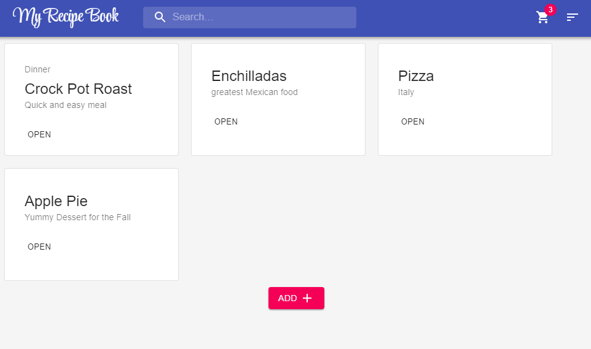
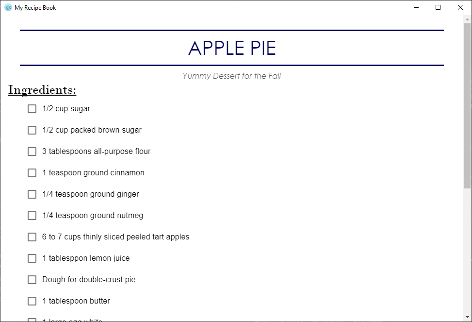
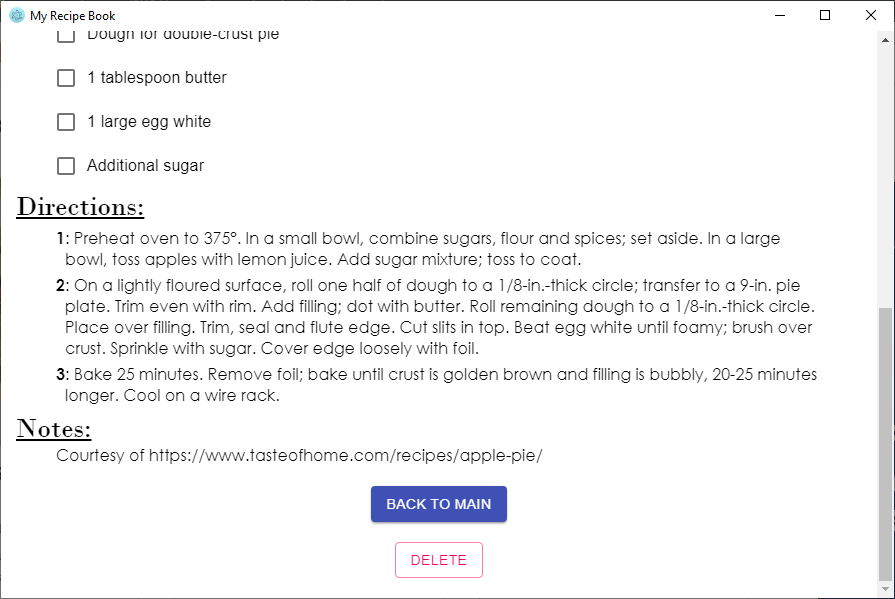
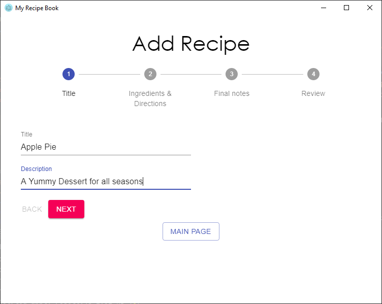

# My Recipe Book 
_Personal app to start your modern recipe book_

My Recipe Book involves all things cooking and recipes. Easily add your 
personal recipes. Add items to your shopping cart. A modern take on a 
recipes books.

###General Info: 

    

    

    

Easily add your recipes!

    

#### Technology
* React.js
* Electron.js

### Get started:
* Run `npm install`

##### Development
* Run `npm run dev` to start webpack-dev-server. Electron will launch automatically after compilation.

##### Production
_Coming soon_
